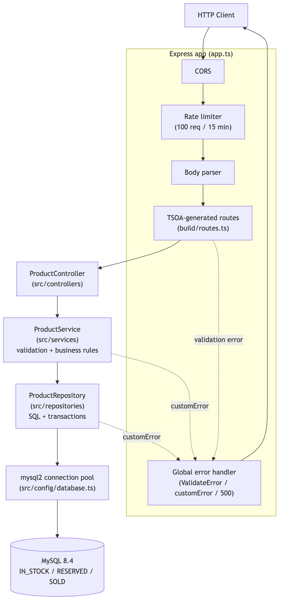

# stock-service

Every stock change — reserve, sell, return, delete — runs inside a `SELECT ... FOR UPDATE` transaction, so concurrent requests on the same product can't race each other. A deliberately three-layer inventory API (no Clean Architecture, no DI container — a single-entity CRUD-plus-transactions domain doesn't earn that complexity) in TypeScript, Express, and MySQL.

This is one of three services in the [stock-reservation-service](../../README.md) system — see the root README for the whole-system picture, including the Kubernetes + Istio service mesh demo.

## Tech Stack

- **Runtime**: Node.js 24, TypeScript
- **Framework**: Express.js
- **Database**: MySQL 8.4 — connection pool, atomic transactions with `SELECT FOR UPDATE`
- **Driver**: mysql2 with prepared statements (SQL injection safe)
- **Documentation**: TSOA + Swagger UI (auto-generated)
- **Tests**: Jest, ts-jest — unit + e2e with real MySQL via Docker
- **Quality**: ESLint, Prettier
- **Container**: Docker + Docker Compose

## Architecture Overview

Three cohesive layers, no framework beyond what the app needs — no domain/use-case layers, no repository interfaces or DI container, since a single-entity CRUD-plus-transactions API doesn't earn that complexity:

- **Controller** (`src/controllers`) — TSOA-decorated HTTP handlers, thin pass-through to the service.
- **Service** (`src/services`) — input validation and business rules.
- **Repository** (`src/repositories`) — SQL queries and transactions against MySQL via `mysql2`.

Reserve/return/sell/delete all run inside a database transaction with `SELECT ... FOR UPDATE` to avoid race conditions when concurrent requests touch the same product.



See [docs/mmd](../../docs/mmd) for the Mermaid sources and additional diagrams: [business flow](../../docs/img/business-flow.png), [database schema](../../docs/img/db-schema.png), and [deployment](../../docs/img/deployment.png).

## Prerequisites

- Node.js >= 24 (matches CI and the Docker image)
- npm >= 8
- Docker + Docker Compose

## Setup

### 1. Clone and install
```bash
git clone https://github.com/luizcurti/stock-reservation-service.git
cd stock-reservation-service/services/stock-service
npm install
```

### 2. Configure environment
```bash
cp .env.example .env
# Default values work for local development
```

### 3. Start the database
```bash
# From the repo root, one level up
docker compose up -d mysql_database
```

### 4. Run the application

```bash
# Development (hot reload)
npm run dev

# Production
npm run build && npm start
```

API available at `http://localhost:3000`.

## Environment Variables

See [.env.example](.env.example) for the full list with defaults. Only variables actually read by the app are defined — no speculative configuration:

| Variable | Description | Default |
|----------|-------------|---------|
| `DB_HOST` | MySQL host | `localhost` |
| `DB_PORT` | MySQL port | `3306` |
| `DB_NAME` | Database name | `stock` |
| `DB_USER` | Database user | `app_user` |
| `DB_PASSWORD` | Database password | — |
| `NODE_ENV` | `development` \| `production` | `development` |
| `PORT` | HTTP port | `3000` |
| `ALLOWED_ORIGINS` | Comma-separated CORS origins. Outside production, defaults to `*` when unset; in production, defaults to denying all origins when unset | — |
| `RATE_LIMIT_MAX` | Max requests per IP per 15-minute window | `100` |
| `SERVICE_VERSION` | Echoed back as the `X-Version` response header — used by the [Istio canary demo](../../docs/mesh.md#canary-release) to tell v1/v2 apart, otherwise not meaningful | `v1` |

## API Reference

Interactive docs at `http://localhost:3000/docs` (requires build).

A ready-to-use Insomnia collection is included at `Insomnia.json`.

### Endpoints

| Method | Path | Description |
|--------|------|-------------|
| `PATCH` | `/product/:id/stock` | Create or update stock for a product |
| `GET` | `/product/:id` | Get stock summary (available, reserved, sold) |
| `POST` | `/product/:id/reserve` | Reserve 1 unit — returns a UUID token |
| `POST` | `/product/:id/sold` | Confirm sale using reservation token |
| `POST` | `/product/:id/return` | Return reserved unit back to stock |
| `DELETE` | `/product/:id` | Delete product (only if no reservations or sales history) |
| `GET` | `/health` | Health check |

### Request / Response examples

#### Create or update stock
```http
PATCH /product/5/stock
Content-Type: application/json

{ "product": "Volleyball", "qtd": 50 }
```
```json
{ "id": 5, "product": "Volleyball", "stock": 50 }
```

#### Get stock summary
```http
GET /product/5
```
```json
{ "ID": 5, "IN_STOCK": 49, "RESERVE": 1, "SOLD": 3 }
```

#### Reserve a unit
```http
POST /product/5/reserve
```
```json
{ "id": 5, "product": "Volleyball", "reservationToken": "550e8400-e29b-41d4-a716-446655440000" }
```

#### Confirm sale
```http
POST /product/5/sold
Content-Type: application/json

{ "reservationToken": "550e8400-e29b-41d4-a716-446655440000" }
```

#### Return reservation to stock
```http
POST /product/5/return
Content-Type: application/json

{ "reservationToken": "550e8400-e29b-41d4-a716-446655440000" }
```

#### Delete product
```http
DELETE /product/5
```
Returns `204 No Content` on success.  
Returns `409 Conflict` if active reservations or sales history exist.

### Error responses

| Status | Meaning |
|--------|---------|
| `400` | Validation error (invalid ID, empty product name, invalid UUID token) |
| `404` | Product or reservation not found |
| `409` | Conflict — cannot delete product with reservations or sales history |
| `422` | Missing required body fields (validated by TSOA) |
| `500` | Internal server error |

## Business Flow

```
 PATCH /stock  →  POST /reserve  →  POST /sold
                        ↓
                 POST /return
```

1. **Create/update stock** — `PATCH /product/:id/stock`
2. **Reserve** — decrements `IN_STOCK` by 1, records token in `RESERVED`
3. **Finalize**:
   - **Sold** — moves token from `RESERVED` to `SOLD` (stock stays decremented)
   - **Return** — removes token from `RESERVED`, increments `IN_STOCK` back
4. **Delete** — removes the product from `IN_STOCK` only when no active reservations or sales history exist

All reserve/return/sell/delete operations use database transactions with `SELECT FOR UPDATE` to prevent race conditions.

## Validation Rules

- `id` must be a positive integer
- `product` must be a non-empty string, max 100 characters
- `qtd` must be a non-negative integer
- `reservationToken` must be a valid **UUID v4** string

## Testing

There is no separate "integration test" tier: the e2e suite below runs the real Express app (in-process, via supertest) against a real MySQL instance, so it already covers both HTTP/API behavior and cross-layer integration without redundant test tiers.

### Unit tests
Mock the repository/database layer; cover service validation and business rules, repository SQL/transaction logic, and controllers.
```bash
npm test
```

### E2E / API tests (requires Docker)
```bash
npm run test:e2e
```

Spins up a real MySQL instance via Docker Compose (`mysql_database` service only) and drives the full HTTP flow with supertest — every endpoint, happy paths, validation errors (400/422), not-found (404), and conflicts (409). A ready-to-use Insomnia collection is also included at [Insomnia.json](Insomnia.json) for manual/exploratory testing.

### Coverage
```bash
npm run test:coverage
```

Current coverage: **100%** statements / branches / functions / lines (unit tests; enforced at a 70% floor in CI).

## Scripts

```bash
npm run dev            # Development with hot reload
npm run build          # Lint + generate TSOA routes/spec + compile TypeScript
npm start              # Start in production mode (requires build first)
npm test               # Run unit tests
npm run test:e2e       # Run e2e/API tests against real MySQL (Docker)
npm run test:coverage  # Run unit tests with coverage report
npm run lint           # ESLint + auto-fix
npm run lint:check     # ESLint check only (used in CI)
npm run format         # Prettier format
npm run format:check   # Prettier check only (used in CI)
npm run typecheck      # tsc --noEmit across src + tests (run `npm run build` first — app.ts imports the generated ./build/routes)
npm run clean          # Remove build/ and coverage/
```

## Project Structure

```
services/stock-service/
├── src/
│   ├── config/          # DB pool, env-driven config, Lambda/local entry points
│   ├── controllers/     # Express route handlers (TSOA)
│   ├── services/        # Business logic + input validation
│   ├── repositories/    # SQL queries + transactions
│   ├── models/          # TypeScript interfaces
│   └── customErrors/    # Custom error class
├── tests/
│   ├── *.spec.ts        # Unit tests
│   └── e2e/             # End-to-end / API tests
├── SQL/
│   └── stock.sql     # Database schema (manual reference / seed data)
├── Dockerfile         # Multi-stage build for the app image
├── build/             # Compiled output (generated; mirrors src/ + app.ts)
└── Insomnia.json      # API collection
```

`docs/` (Mermaid sources + rendered diagrams) and `docker-compose.yml` (app + MySQL services) live at the repo root — see the [root README](../../README.md).

## Database Schema

```sql
CREATE TABLE `IN_STOCK` (
  `id`         int NOT NULL PRIMARY KEY,
  `product`    varchar(100) NOT NULL,
  `qtd`        int NOT NULL DEFAULT 0,
  `created_at` timestamp DEFAULT CURRENT_TIMESTAMP,
  `updated_at` timestamp DEFAULT CURRENT_TIMESTAMP ON UPDATE CURRENT_TIMESTAMP
);

CREATE TABLE `RESERVED` (
  `id`               int NOT NULL AUTO_INCREMENT PRIMARY KEY,
  `id_stock`         int NOT NULL,
  `product`          varchar(100) NOT NULL,
  `reservationToken` varchar(100) NOT NULL UNIQUE,
  `created_at`       timestamp DEFAULT CURRENT_TIMESTAMP,
  `expires_at`       timestamp DEFAULT (DATE_ADD(CURRENT_TIMESTAMP, INTERVAL 24 HOUR)),
  FOREIGN KEY (`id_stock`) REFERENCES `IN_STOCK`(`id`) ON DELETE CASCADE
);

CREATE TABLE `SOLD` (
  `id`               int NOT NULL AUTO_INCREMENT PRIMARY KEY,
  `id_stock`         int NOT NULL,
  `product`          varchar(100) NOT NULL,
  `reservationToken` varchar(100) NOT NULL UNIQUE,
  `sold_at`          timestamp DEFAULT CURRENT_TIMESTAMP,
  FOREIGN KEY (`id_stock`) REFERENCES `IN_STOCK`(`id`)
);
```

## Docker

The root [docker-compose.yml](../../docker-compose.yml) defines `mysql_database` (MySQL 8.4) and `app` (built from this service's [Dockerfile](Dockerfile), a multi-stage build that compiles TypeScript in a `build` stage and ships only production dependencies + compiled output in the final image), alongside `order-service` and `payment-service` — see the [root README](../../README.md) for the whole stack.

```bash
# From the repo root: build and start the full stack (all services + MySQL)
docker compose up -d --build

# stock-service available at http://localhost:3000, MySQL at localhost:3306
curl http://localhost:3000/health

# Stop and remove containers (add -v to also drop the MySQL volume)
docker compose down
```

To run only the database (e.g. for local `npm run dev` against a containerized MySQL):
```bash
docker compose up -d mysql_database
```

The `app` service reads its database connection from `DB_HOST=mysql_database` (the Compose service name) and otherwise uses the same environment variables as [.env.example](.env.example), overridable via a `.env` file in the repo root (Docker Compose loads it automatically for variable substitution).

## CI

GitHub Actions ([.github/workflows/ci.yml](../../.github/workflows/ci.yml)) runs on every push and pull request to `main`, in two jobs (scoped to `services/stock-service` via a working-directory default):

1. **test** — install (`npm ci`), `npm audit` on production dependencies (fails on high/critical), format check, lint, typecheck, unit tests with coverage, build, and e2e tests (real MySQL via Docker Compose). Coverage is uploaded as a build artifact.
2. **docker** (runs after `test` passes) — brings up the full stack (all three services + MySQL) with Docker Compose and runs the whole-stack integration test ([`scripts/integration-test.sh`](../../scripts/integration-test.sh)) against it, over real HTTP.

The pipeline fails if any step fails — nothing is silently skipped.

## Architectural Decisions

- **Three layers, no more.** Controller → Service → Repository is enough for a single-entity CRUD-plus-transactions API. No domain/use-case layer, no repository interfaces, no DI container — they would add indirection without solving a problem this codebase has.
- **TSOA over hand-written route glue.** Controllers stay decorator-based; routes, request validation, and the OpenAPI spec are generated from the same source of truth, so they can't drift.
- **`SELECT ... FOR UPDATE` transactions, not optimistic locking.** Reservation is low-contention per row but must never oversell the last unit; pessimistic row locks inside a transaction are the simplest correct solution here.
- **`@tsoa/runtime` as the production dependency, `tsoa` (which bundles the `@tsoa/cli` codegen tool) as dev-only.** The CLI is only needed to generate routes/spec at build time; keeping it out of the production `node_modules` tree removes its vulnerable transitive dependency from the deployed image entirely (verified via `npm audit --omit=dev`) without requiring a breaking downgrade.
- **In-process e2e tests over full HTTP e2e tests.** The e2e suite imports the Express app directly (via supertest) against a real, Dockerized MySQL instance rather than making network calls to a running server. This is faster and avoids port/startup flakiness while still exercising real SQL, real transactions, and real HTTP status/body contracts. A separate whole-stack integration test in CI (`scripts/integration-test.sh`) covers the "does the container actually start and serve real traffic, including across services" concern.

## Troubleshooting

**MySQL connection errors**
```bash
docker compose ps                     # Check container status
docker compose down && docker compose up -d mysql_database  # Restart
```

**Build errors**
```bash
npm run clean && npm run build
```

**Reinstall dependencies**
```bash
rm -rf node_modules && npm ci   # package-lock.json is committed — keep it
```
